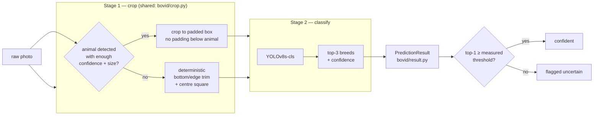
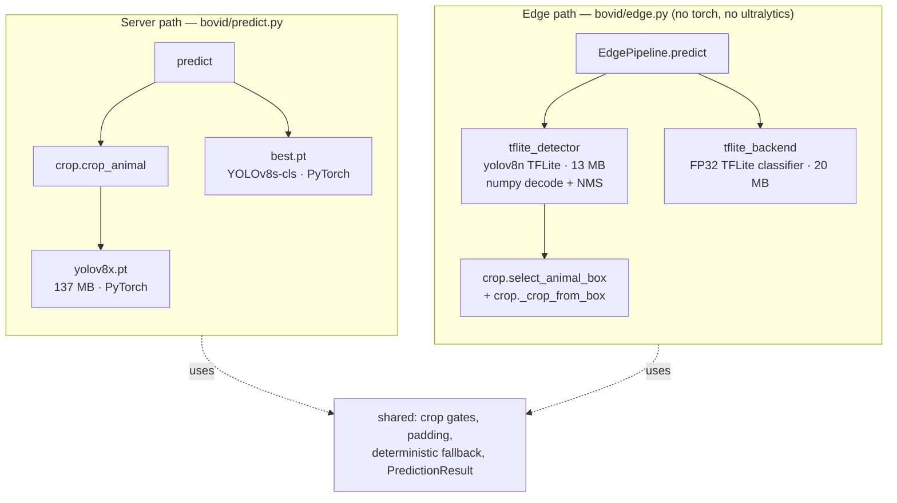
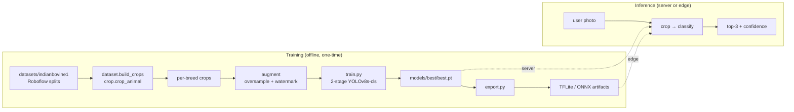

# Architecture

How `bovid` is put together: the data flow, what each module owns, and how the **server** and
**edge** paths share one pipeline while swapping only their model backends. For *why* each
decision was made (with the measurements behind it), see [METHODOLOGY.md](METHODOLOGY.md); this
document is the structural map.

## System overview



The two stages are the whole product. Stage 1 is **the same code** whether the request comes from
the CLI, the app, evaluation, or a device — that shared crop is what prevents train/serve skew.

## The two deployment paths

Both paths run the identical `detect → crop → classify` flow and return the identical
`PredictionResult`. Only the model backends and runtime differ — so a caller cannot tell which
one produced a result, and the two cannot silently drift apart.



The shared box below the two paths is the important part. Box **selection** (the class + coverage
gates), the padding maths, the deterministic fallback, and the result contract are single
implementations used by both — see `crop.select_animal_box` and `crop._crop_from_box`. Duplicating
them would let a device and a laptop crop the same photo differently.

Selection is config-only — no code change switches detectors:

```bash
BOVID_DETECTOR_MODEL=models/pretrained/yolov8n_float32.tflite bovid predict img.jpg
bovid predict --edge img.jpg      # the full torch-free path
```

## Module responsibilities

| Module | Owns | Notes |
|---|---|---|
| `config.py` | All paths + hyperparameters; validation at import | Every knob overridable via `BOVID_*`. `DEVICE` is resolved **lazily** so importing the package never pulls in torch (the edge path depends on this). |
| `crop.py` | Stage 1: detect + crop, and the shared box/fallback logic | Used identically by training-prep and inference. `select_animal_box` is shared by server and edge. |
| `result.py` | `Prediction`, `PredictionResult` — the output contract | Kept separate from `predict.py` (which imports torch) so `edge.py` can return the same objects without importing torch. |
| `predict.py` | Server inference API | `load_model`, `predict`, `predict_batch`. |
| `edge.py` | Torch-free edge pipeline (`EdgePipeline`) | Composes the TFLite detector + classifier; same contract as `predict`. |
| `tflite_detector.py` | YOLOv8 detector on TFLite | Letterbox, `(1,84,8400)` decode, NMS — all numpy. Delegates gating to `crop.select_animal_box`. |
| `tflite_backend.py` | TFLite classifier runner | Disables the XNNPACK delegate (it can't prepare the graph); PIL-exact preprocessing to match Ultralytics. |
| `dataset.py` | Roboflow splits → cropped per-breed layout | `source_group` (the leakage-prevention key), oversampling. |
| `augment.py` | Synthetic watermark + real-world corruptions | Deterministic under a seed. |
| `train.py` | Two-stage training → validate → export | Canonical pipeline. |
| `evaluate.py` | Full-pipeline accuracy + calibration | `topk_metrics` is a pure function (unit-tested). |
| `export.py` | ONNX / TFLite / SavedModel export | Handles the INT8 filename mismatch and same-file copies. |
| `audit.py` | OCR scan for baked-in watermarks | Data-quality tooling. |
| `cli.py` | `bovid` entry point | `predict` (`--edge`) / `evaluate` / `train` / `export` / `audit`. |
| `utils.py` | Image IO (EXIF-correct, BGR convention) | Shared by crop and inference. |

## Data flow: training vs. inference



Cropping happens **once, up front** for training (it is a deterministic detector step, so it
leaks nothing) and **per-request** at inference — but through the *same* `crop_animal`/`_crop_from_box`
code, so the crops are distributionally identical. This is the structural guarantee behind the
"no train/serve skew" claim.

## Evaluation & trust

Accuracy is measured by **grouped 5-fold cross-validation** (`scripts/kfold.py`), keyed on the
source-photo prefix so augmentation siblings never straddle train/val. This is the reason the
reported ~53% is trustworthy where a naive split reports a leaked ~93%. The parity between paths
is itself tested (`scripts/compare_*` + `tests/integration_tests.py`), so the diagrams above are
enforced, not aspirational. Details in [METHODOLOGY.md §5](METHODOLOGY.md).
